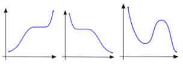
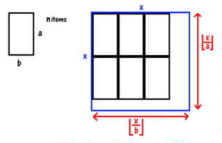

# Algoritma Searching

## Linear Search

Algoritma searching yang paling mudah untuk dipahami dan diimplementasikan adalah **Linear Search** atau biasa juga disebut dengan **Sequential Search**. Linear Search bekerja dengan melakukan pengecekan kepada semua elemen yang ada.

Secara garis besar, cara kerja Linear Search adalah:

1. Memeriksa item satu per satu.
2. Apabila ditemukan, maka “ketemu”.
3. Jika sampai akhir belum ditemukan, maka item yang dicari tidak ada.

**Implementasi Linear Search**

```c
int linearSearch(int arr[], int n, int item) {
   int i;
   for(i = 0; i < n; ++i) {
      if(item == arr[i])
         return 1;
   }
   return -1;
}
```

## Binary Search

**Binary Search** adalah teknik pencarian di mana untuk setiap iterasinya kita membagi _space_ pencarian menjadi hanya setengah dari _space_ pencarian awal hingga kita menemukan yang kita cari.

Untuk menerapkan teknik ini, kita harus memastikan bahwa data yang kita punya memiliki properti monoton naik atau turun ([https://en.wikipedia.org/wiki/Monotonic_function](https://en.wikipedia.org/wiki/Monotonic_function)).



> Gambar kiri dan tengah memiliki properti monoton serta gambar kanan tidak.

### Contoh 1

Ada array ukuran N (N <= 10^5), elemennya bisa sampai 10^9, arraynya sorted secara _ascending_.\
Ada Q query (Q <= 10^5). Tiap query dikasih angka K, jawab kalau K ada di array atau tidak.

Kata kunci: **Sorted**\
Karena arraynya _sorted_, berarti array tersebut memiliki properti monoton.

**Contoh**\
[2,3,8,10,13,17,28,35]

Cukup jelas kalau array-nya monoton. Sekarang bagaimana melakukan Binary Search-nya?

Misalkan kita mau mengecek apakah angka 13 ada di array atau tidak. (i.e.: target = 13)

1. _Space_ pencarian kita adalah index [1,8].
2. Sekarang kita bagi array jadi 2 bagian, index [1,4] dan index [5,8]. Untuk tau target ktia ada di array pertama atau kedua, kita tinggal mengecek nilai tengah dari _space_ pencarian kita saat ini yaitu di index **(1 + 8) / 2 = 4**.
   > Ini dibulatkan ke bawah karena index 4,5 tidak ada 🧐
3. Array pada index 4 bernilai 10. Karena kita tau bahwa array-nya _sorted_ secara _ascending_, berarti **index dari elemen 13 pasti berada di kanannya**.
4. Sekarang _space_ dari pencarian kita adalah index[5,8].
5. Bagi array menjadi 2 bagian lagi, [5,6] dan [7,8]. Lalu cek tengahnya lagi yaitu di index **(5 + 8) / 2 = 6**.
6. Array pada index 6 bernilai 17. Karena kita tahu bahwa array-nya _sorted_ secara _ascending_, berarti **index dari elemen 13 pasti berada di kirinya**.
7. Sekarang _space_ dari pencarian kita adalah index[5,5].
8. Karena hanya tinggal tersisa 1 index, **kita hanya perlu mengecek apakah index 5 bernilai 13 atau tidak**.

**Visualisasi dan contoh implementasi**: [https://csacademy.com/lesson/binary_search](https://csacademy.com/lesson/binary_search)

Perhatikan bahwa pada proses pencarian, kita selalu membagi _space_ pencarian kita menjadi setengahnya. Maka dari itu, pada kasus terburuknya, iterasi akan dilakukan sebanyak **log2(N)** kali.

### Contoh 2

Ada N segi empat berukuran a x b. Segi empatnya tidak dapat diputar. Tentukan ukuran persegi terbesar yang bisa memuat semua segi empat tadi.

**Solusi**

Pengisian segi empat yang optimal adalah seperti berikut.



Dengan begitu, kita dapat membuat sebuah fungsi sebagai berikut:

<a href="https://www.codecogs.com/eqnedit.php?latex=f(x)&space;=&space;1,&space;jika&space;\frac{x}{a}&space;\times&space;\frac{x}{b}&space;\geq&space;n" target="_blank"></a>

<a href="https://www.codecogs.com/eqnedit.php?latex=f(x)&space;=&space;0,&space;jika&space;\&space;sebaliknya" target="_blank"></a>

Dapat dilihat bahwa jika untuk suatu K, nilai f(K)= 1, maka pasti nilai **f(K + 1) = 1**. Yang artinya fungsi tersebut memiliki properti **monoton**.

Sekarang, kita hanya perlu mencari nilai K terkecil sehingga nilai **f(K) = 1**.

**Contoh implementasi**

```c
bool f(int k, int a, int b, int n) {
   return ((k/a) * (b/a) >= n);
}

int binser(int a, int b, int n) {
   int l = 1;
   int r = 100000;
   while (r - l > 1) {
      int mid = (l + r) >> 1;
      bool can = f(mid);
      if(can)
         r = mid;
      else
         l = mid + 1;
   }
   if (can(l))
      return l;
   else
      return r;
}
```
